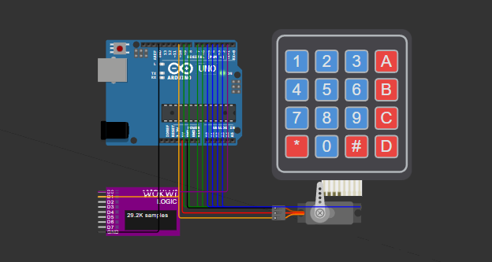
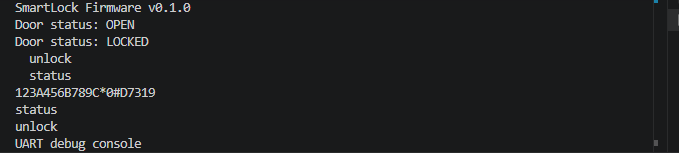
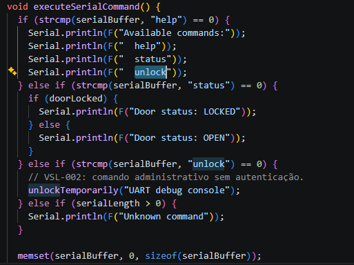
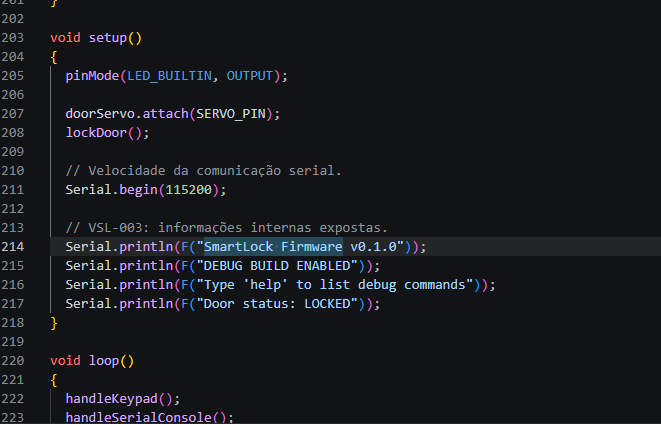
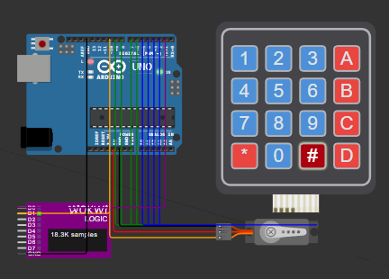

# Virtual Smart Lock Security Assessment

A controlled embedded-security assessment of a simulated Arduino smart lock. The lab explores firmware analysis, hardcoded credentials, UART attack surface, information disclosure, remediation, and final verification without requiring physical hardware.

> This project was created and tested exclusively in a local Wokwi simulation. It is an educational security assessment, not a production-ready access-control system.



## Project goals

- Build a functional smart-lock prototype with an Arduino Uno, a 4x4 keypad, and a servo.
- Establish normal behavior with valid and invalid PIN tests.
- Analyze the compiled AVR firmware instead of relying only on source-code review.
- Identify security weaknesses in credentials, UART commands, and debug information.
- Apply targeted remediations and verify the final ELF statically.
- Document limitations honestly, especially those imposed by the Arduino Uno.

## Architecture

| Component | Purpose | Arduino connection |
|---|---|---|
| Arduino Uno | Main controller | — |
| 4x4 keypad | PIN input | Rows: D9–D6; columns: D5–D2 |
| Servo | Lock actuator | PWM: D10; power: 5V/GND |
| Built-in LED | Visual door-state indicator | `LED_BUILTIN` |
| UART console | Diagnostic interface | 115200 baud |
| Logic analyzer | Optional signal capture | D0: TX/D1; D1: servo PWM |

The locked position is represented by a servo angle of 0°. A valid PIN moves the servo to 90° for three seconds before the door is locked again.

## Threat model and scope

The assessment assumes an attacker can obtain a copy of the compiled firmware or inspect locally accessible diagnostic interfaces. The following activities were in scope:

- functional testing of the keypad and lock behavior;
- source-code review;
- extraction of printable strings from the AVR ELF;
- review of the UART command handler;
- remediation review and recompilation;
- static verification of the final firmware.

Physical flash extraction, JTAG/SWD probing, fault injection, voltage glitching, side-channel analysis, and attacks against a real device were outside the scope.

## Findings

| ID | Finding | Severity | Status |
|---|---|---:|---|
| VSL-001 | Hardcoded administrator PIN | High | Open / residual risk |
| VSL-002 | Unauthenticated UART unlock command | High | Remediated |
| VSL-003 | Debug and version information disclosure | Low | Remediated |

### VSL-001 — Hardcoded administrator PIN

The administrator PIN was stored as a plaintext constant in program memory. Running `avr-strings` against the compiled ELF recovered the keypad map followed by the PIN:

```text
123A456B789C*0#D7319
```



This finding remains an architectural limitation of the demo. Moving the PIN to the Arduino Uno EEPROM would only change its storage location, while storing a verifier for a four-digit PIN would still permit a very small offline search space. A production design should use unique per-device provisioning, protected credential storage or a secure element, a larger secret, attempt throttling, and lockout controls.

### VSL-002 — Unauthenticated UART unlock command

Source review identified an administrative `unlock` command that called the door-unlocking routine without validating a PIN or another authorization factor.



The command was removed from both the UART help output and the command handler. The final firmware retains only non-administrative `help` and `status` functionality. Dynamic UART exploitation was not performed; confirmation and remediation were established through source review, successful compilation, and static analysis of the final ELF.

### VSL-003 — Debug and version information disclosure

The initial startup banner disclosed the firmware version, debug-build status, and the existence of a diagnostic command interface.



The detailed banner and debug-specific messages were replaced with generic operational output. Static verification confirmed that the sensitive banner strings were absent from the final ELF.

## Final verification

The hardened build was checked for the following strings:

```text
SmartLock Firmware
DEBUG BUILD
UART debug console
unlock
```

The exact standalone UART command and sensitive debug strings were not found:

```text
PASS: sensitive debug and UART command strings were not found.
```


The keypad workflow was then retested to verify that the lock still accepted the valid PIN, moved the servo to the unlocked position, and relocked after three seconds.



## Evidence index

| Evidence | Description |
|---|---|
| [01](./evidence/01-lab-overview-locked.png) | Initial locked-state overview |
| [02](./evidence/02-invalid-pin.png) | Invalid PIN remains denied |
| [03](./evidence/03-valid-pin-unlock.png) | Valid PIN unlock behavior |
| [04](./evidence/04-hardcoded-pin-firmware-public.png) | PIN recovered from the compiled ELF |
| [05](./evidence/05-unauthenticated-uart-code-review.png) | Unauthenticated UART path found in source |
| [06](./evidence/06-debug-information-disclosure.png) | Version and debug disclosure |
| [07](./evidence/07-final-static-verification-public.png) | Static verification after remediation |
| [08](./evidence/08-final-functional-retest.png) | Final functional regression test |

The raw filtered string output is available in [`04-firmware-strings.txt`](./evidence/04-firmware-strings.txt). An optional VCD capture is also included for future signal-analysis work, but it was not used to substantiate the reported findings.

## Build environment

- Arduino AVR Boards core: 1.8.8
- AVR GCC: 7.3.0-atmel3.6.1-arduino7
- Keypad library: 3.1.1
- Servo library: 1.3.0
- Target: Arduino Uno / ATmega328P
- Simulation: Wokwi for VS Code

Final local build hashes:

```text
virtual-smart-lock.ino.elf
SHA-256: 0F88969509C0E5340E91D20F380647C0982A7D2EA7E23DEA9521FDA09DA38350

virtual-smart-lock.ino.hex
SHA-256: 4C5B5A1B382A600D7A7DDE9D3F237933EC1D260D562A8D3F97535B40A74A4606
```

These hashes identify the locally assessed artifacts. Rebuilding with another toolchain version may produce different hashes.

## Reproducing the lab

### Requirements

- Arduino CLI or Arduino IDE
- Wokwi extension for VS Code
- Arduino AVR Boards core
- `Keypad` and `Servo` Arduino libraries

Install the required platform and libraries:

```powershell
arduino-cli core install arduino:avr
arduino-cli lib install Keypad
arduino-cli lib install Servo
```

Compile the firmware from the project directory:

```powershell
arduino-cli compile --fqbn arduino:avr:uno --output-dir build .
```

Open the directory in VS Code, compile the sketch, and run **Wokwi: Start Simulation** from the Command Palette. The simulation configuration in [`wokwi.toml`](./wokwi.toml) loads the generated HEX and ELF files.

To reproduce the firmware string review with the AVR toolchain:

```powershell
avr-strings.exe -a .\build\virtual-smart-lock.ino.elf
```

## Repository structure

```text
.
├── virtual-smart-lock.ino
├── diagram.json
├── wokwi.toml
├── README.md
├── virtual-smart-lock-security-assessment-guide.pdf
└── evidence/
    ├── 01-lab-overview-locked.png
    ├── 02-invalid-pin.png
    ├── 03-valid-pin-unlock.png
    ├── 04-firmware-strings.txt
    ├── 04-hardcoded-pin-firmware-public.png
    ├── 05-unauthenticated-uart-code-review.png
    ├── 06-debug-information-disclosure.png
    ├── 07-final-static-verification-public.png
    ├── 08-final-functional-retest.png
    ├── smart-lock-capture.vcd
    └── wokui.png
```

## Lessons learned

- Compiled firmware can expose secrets that are not obvious during normal operation.
- Physical or diagnostic interfaces must be treated as part of the attack surface.
- Removing a visible command is not enough unless the rebuilt artifact is verified.
- A mitigation should not be presented as complete when the selected hardware cannot provide the required security boundary.
- Clear evidence and honest scope limitations are as important as the vulnerability itself.

## Documentation

- [Complete lab guide](./virtual-smart-lock-security-assessment-guide.pdf)
- A narrative write-up with additional context, GIFs, and questionable cybersecurity humor will be published on [m4gicxleep's blog](https://m4gicxleep.github.io/).

## Disclaimer

All testing was performed in a fully controlled simulation created for this project. The techniques and findings are documented for education, defensive engineering, and authorized security research.
